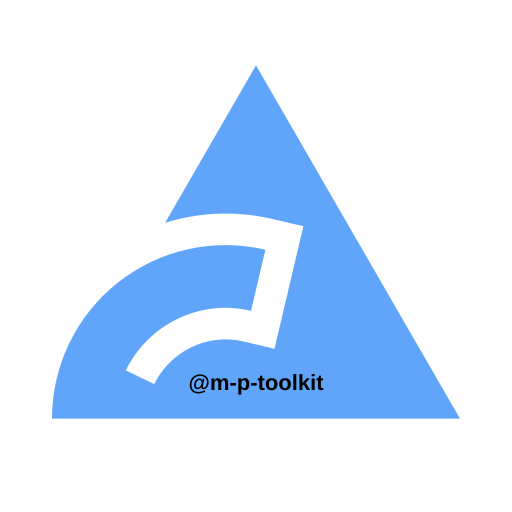

<p align="center">
  
</p>

# `@m-p-toolkit/biome-config`

<p align="center">
  <a href="https://www.npmjs.com/package/@m-p-toolkit/biome-config">
    
  </a>
</p>

Personal Biome configuration shared across Marlon Passos projects.

## Presets

- `base`: shared formatter and linter defaults
- `node`: Node-specific rules on top of `base`
- `react`: React-specific rules on top of `base`

## Installation

```bash
pnpm add -D @m-p-toolkit/biome-config @biomejs/biome
```

## Usage

Create a `biome.json` file and extend one of the published presets.

### Base

```json
{
  "extends": ["@m-p-toolkit/biome-config/base"]
}
```

### Node

```json
{
  "extends": ["@m-p-toolkit/biome-config/node"]
}
```

### React

```json
{
  "extends": ["@m-p-toolkit/biome-config/react"]
}
```

### Optional Plugins

Biome resolves plugin paths from the consuming project configuration, so add
package plugins explicitly when you want them enabled.

```json
{
  "extends": ["@m-p-toolkit/biome-config/node"],
  "plugins": [
    "./node_modules/@m-p-toolkit/biome-config/plugins/prefer-direct-filter-callback.grit"
  ]
}
```

## Contributing

See the [contributing guide](../../CONTRIBUTING.md).

## Changelog

See the [package changelog](./CHANGELOG.md).
