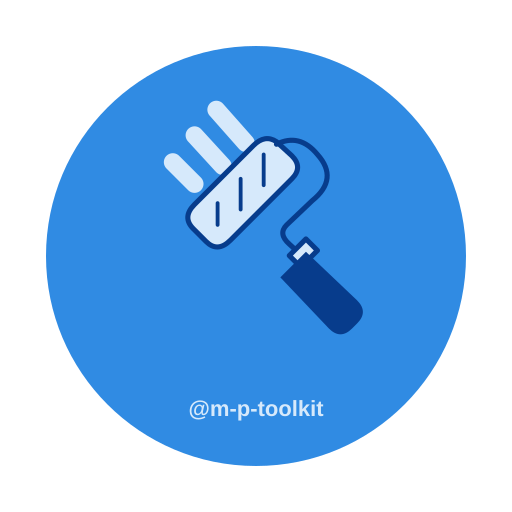

<p align="center">
  
</p>

# `renovate-config`

<p align="center">
  <a href="https://github.com/MarlonPassos-git/marlon-passos-toolkit/tags">
    
  </a>
</p>

Personal Renovate configuration shared across Marlon Passos projects.

## Usage

Create a `renovate.json` file and extend the tagged preset.

```json
{
  "$schema": "https://docs.renovatebot.com/renovate-schema.json",
  "extends": [
    "github>MarlonPassos-git/marlon-passos-toolkit//packages/renovate-config/default.json#renovate-config-v1.0.0"
  ]
}
```

Renovate reads the preset directly from GitHub. No npm installation is needed.

## Contributing

See the [contributing guide](../../CONTRIBUTING.md).

## Changelog

See the [configuration changelog](./CHANGELOG.md).
